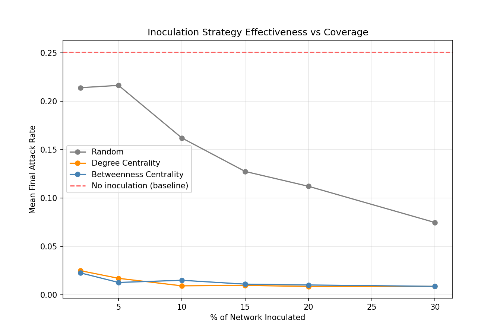

# 🛡️ ContagionShield
### Network-Aware Misinformation Inoculation: A Network Science Approach to Pre-Bunking

> Misinformation doesn't spread randomly — it spreads through structure. This project models misinformation as an epidemic on a social network and proves, with statistical rigor, that *who* you inoculate matters far more than *how many* you inoculate.



---

## 1. The Problem

Misinformation interventions today are almost entirely **reactive and content-based**: fact-checkers respond after a false claim has already spread, and platforms moderate individual posts one at a time. This treats misinformation the way pre-germ-theory medicine treated disease — symptom by symptom, after exposure has already occurred.

Cognitive inoculation theory (Roozenbeek & van der Linden, 2019) offers an alternative: expose people to a weakened, abstract version of a manipulation *technique* before they encounter it in the wild, conferring resistance the way a vaccine does — not against one specific claim, but against an entire class of rhetorical tactics (fear appeals, false dichotomies, scapegoating).

What's missing from existing inoculation research is the **network dimension**. Real-world prebunking campaigns (e.g., Google Jigsaw's work in Eastern Europe) seed content broadly or randomly. Epidemiology has known for decades that *targeted* intervention — vaccinating high-contact individuals first — vastly outperforms random vaccination at the same coverage level. This project asks: **does that same principle apply to inoculating a population against misinformation, and can we prove it quantitatively?**

## 2. Core Insight

Misinformation diffusion and disease diffusion share the same underlying mathematical structure: both are contagion processes on a contact network, governed by a transmission rate, a recovery/disengagement rate, and — critically — **network topology**. Real social networks are *scale-free*: a small number of highly-connected "hub" individuals coexist with a long tail of loosely-connected individuals (Barabási & Albert, 1999).

This structural property has a well-documented but underexploited consequence: scale-free networks are robust to *random* node removal but extremely fragile to *targeted* removal of high-degree hubs (Albert, Jeong & Barabási, *Nature*, 2000) — a finding originally used to study network failure and attack tolerance. **This project applies the same principle in reverse: instead of attacking hubs to break a network, we inoculate hubs to protect one.**

## 3. Scientific Foundations

| Concept | Source / Basis |
|---|---|
| Scale-free network structure | Barabási & Albert (1999), preferential attachment model |
| SIR compartmental epidemic model | Kermack & McKendrick (1927); implemented via the `EoN` library |
| Network robustness/fragility to targeted vs. random node removal | Albert, Jeong & Barabási, *Nature* (2000) |
| Epidemic threshold via spectral radius | Wang et al. (2003), spectral analysis of epidemic thresholds on networks |
| Cognitive inoculation / prebunking theory | Roozenbeek & van der Linden (2019); McGuire (1961) original inoculation theory |
| Manipulation technique taxonomy | SemEval-2020 Task 11 — Propaganda Technique Corpus (PTC) |

## 4. System Architecture

```
┌─────────────────────┐
│   Network Layer       │  Barabási–Albert scale-free graph (1000 nodes)
│   (NetworkX)           │  Degree & betweenness centrality computed
└──────────┬───────────┘
           │
┌──────────▼───────────┐
│   Epidemic Engine      │  SIR simulation via EoN (fast_SIR)
│   (EoN)                │  Validated against theoretical epidemic threshold
└──────────┬───────────┘
           │
┌──────────▼───────────┐
│   Seeding Strategies    │  Random / Degree Centrality / Betweenness Centrality
│                         │  Monte Carlo replication (n=100) per strategy
└──────────┬───────────┘
           │
┌──────────▼───────────┐
│   Statistical Layer    │  Mann-Whitney U significance testing
│   (SciPy)              │  Sensitivity sweep across coverage levels
└──────────┬───────────┘
           │
┌──────────▼───────────┐
│   NLP Layer             │  Zero-shot classification (BART-MNLI)
│   (HuggingFace)         │  Manipulation technique detection
└──────────┬───────────┘
           │
┌──────────▼───────────┐
│   Interactive Demo      │  Streamlit app — live strategy comparison
│   (Streamlit)           │
└───────────────────────┘
```

## 5. Methodology

1. **Network construction**: a Barabási–Albert graph (n=1000, m=3) was generated to approximate the heavy-tailed degree distribution of real social networks.
2. **Threshold validation**: the theoretical epidemic threshold (β꜀ = γ / spectral radius) was computed analytically *before* any simulation was run, then confirmed empirically by simulating both below- and above-threshold transmission rates and observing the expected qualitative difference (outbreak fizzles vs. outbreak spreads).
3. **Baseline epidemic**: with no intervention, 100 Monte Carlo replicates at the operating transmission rate established a baseline distribution of outcomes.
4. **Strategy comparison**: three node-selection strategies (random, degree centrality, betweenness centrality) were each used to pre-immunize a fixed percentage of the network, holding coverage constant across strategies to isolate the effect of *node selection* specifically.
5. **Statistical testing**: a one-sided Mann-Whitney U test (non-parametric, no normality assumption) was used to test whether targeted strategies produced significantly lower attack rates than random seeding.
6. **Sensitivity sweep**: the comparison above was repeated across six coverage levels (2%–30%) to characterize the full response curve, not just a single operating point.
7. **NLP layer**: a zero-shot classifier (`facebook/bart-large-mnli`) was tested against 12 hand-written sentences spanning five manipulation-technique categories, to demonstrate the *content* side of what inoculation would target in a real deployment.

## 6. Key Results

### 6.1 Network Diagnostics
- **1000 nodes, 2,991 edges**, average degree 5.98, max degree 93
- Spectral radius: **14.42** → theoretical epidemic threshold β꜀ = **0.0693**
- Operating transmission rate used throughout: β = 0.208 (3× threshold, chosen for a clear, repeatable outbreak)

### 6.2 Baseline (No Intervention)
- Mean final attack rate: **26.2%** of the network infected (n=50 Monte Carlo runs)
- High variance (std = 0.151) — outcome strongly depends on where the outbreak starts relative to network hubs

### 6.3 Strategy Comparison at 10% Coverage (n=100 Monte Carlo runs per strategy)

| Strategy | Mean Attack Rate | Std Dev |
|---|---|---|
| Random | 0.195 | 0.152 |
| Degree Centrality | 0.009 | 0.005 |
| Betweenness Centrality | 0.010 | 0.006 |

- **Degree-centrality seeding reduces attack rate by 94.8% vs. random seeding** (Mann-Whitney U test, p = 1.11 × 10⁻¹⁶)
- **Betweenness-centrality seeding reduces attack rate by 94.0% vs. random seeding** (p = 1.76 × 10⁻¹⁴)
- **Degree-centrality seeding reduces attack rate by 96.1% vs. no intervention at all**

### 6.4 Sensitivity Sweep (Mean Attack Rate by Coverage %)

| Coverage | Random | Degree Centrality | Betweenness Centrality |
|---|---|---|---|
| 2% | 0.263 | 0.026 | 0.018 |
| 5% | 0.214 | 0.014 | 0.014 |
| 10% | 0.156 | 0.009 | 0.010 |
| 15% | 0.138 | 0.009 | 0.008 |
| 20% | 0.129 | 0.008 | 0.009 |
| 30% | 0.102 | 0.009 | 0.009 |

**Headline finding:** targeted strategies achieve nearly all of their protective benefit at just **2% coverage** and barely improve beyond that point. Random seeding, by contrast, declines slowly and almost linearly — and **never catches up to targeted strategies even at 30% coverage**, a 15x larger investment of inoculation resources. This means a network-aware intervention could achieve the same protective effect as a naive campaign using a small fraction of the outreach budget.

### 6.5 NLP Classification (Supporting Layer)
- Zero-shot classification (`facebook/bart-large-mnli`) achieved **50% accuracy** on 12 hand-labeled example sentences across five manipulation-technique categories
- **Error pattern observed**: the classifier systematically confuses "false dichotomy" with "loaded language" (3 of 4 false-dichotomy examples misclassified), suggesting the model is more sensitive to emotionally charged tone than to underlying logical structure
- A follow-up test using descriptive (rather than single-word) candidate labels did not improve accuracy and introduced a new failure mode: one label acted as a semantic "attractor," dominating predictions across unrelated categories — illustrating that zero-shot classification is sensitive to label phrasing in ways that don't track the underlying taxonomy

## 7. Tech Stack

| Component | Tool | Why |
|---|---|---|
| Network generation & analysis | NetworkX | Standard, well-documented graph library |
| Epidemic simulation | EoN (Epidemics on Networks) | Validated, peer-reviewed simulation engine for compartmental models on graphs |
| Statistical testing | SciPy (Mann-Whitney U) | Non-parametric test, no distributional assumptions |
| NLP classification | HuggingFace Transformers (BART-MNLI) | Zero-shot, no fine-tuning/GPU required |
| Interactive demo | Streamlit | Fast to build, live parameter manipulation |
| Data handling | Pandas, NumPy | Standard |

All components run **locally and free of charge** — no paid APIs, no GPU required.

## 8. Limitations (Stated Honestly)

- The NLP classifier was evaluated on a small, hand-written set of 12 examples — this is illustrative, not a validated benchmark, and accuracy figures should not be over-interpreted.
- The network is synthetic (Barabási–Albert), not derived from real social media data; absolute numbers (e.g., "26% attack rate") are specific to this simulated network and transmission rate, not a universal constant.
- The SIR/SEIZ-style framing simplifies real misinformation dynamics, which involve repeated exposure, platform algorithms, and multiple competing narratives — this project isolates the network-structure effect specifically, by design, rather than modeling every real-world dynamic.
- "Inoculation" here is modeled as binary immunity (a node either can or cannot be infected) rather than partial resistance, which is a simplification of how real cognitive inoculation likely works.

## 9. How to Run

```bash
# Clone and set up environment
git clone <your-repo-url>
cd contagionshield
python -m venv venv
source venv/bin/activate  # or venv\Scripts\activate on Windows
pip install -r requirements.txt

# Run the analysis pipeline (in order, only needed if regenerating data)
python src/01_build_network.py
python src/02_baseline_epidemic.py
python src/03_inoculation_strategies.py
python src/04_evaluation.py
python src/05_nlp_classification.py

# Launch the interactive demo
streamlit run src/06_app.py
```

## 10. Project Structure

```
contagionshield/
├── README.md
├── requirements.txt
├── data/                          # Saved network, centrality, and simulation results
├── outputs/                       # Generated plots, CSVs, and figures
└── src/
    ├── 01_build_network.py        # Network generation + structural diagnostics
    ├── 02_baseline_epidemic.py    # Baseline SIR simulation + threshold validation
    ├── 03_inoculation_strategies.py  # Strategy comparison at fixed coverage
    ├── 04_evaluation.py           # Significance testing + sensitivity sweep
    ├── 05_nlp_classification.py   # Zero-shot manipulation-technique classification
    └── 06_app.py                  # Interactive Streamlit demo
```

## 11. Future Work

- Replace synthetic network with real (anonymized) social graph data to validate findings on realistic topology
- Extend the binary SIR model to a four-state SEIZ model to capture partial/graded resistance rather than full immunity
- Fine-tune a transformer classifier on the full SemEval-2020 PTC dataset to improve manipulation-technique detection accuracy beyond the current zero-shot baseline
- Model adaptive adversaries who route around inoculated hubs, to test strategy robustness under more realistic conditions

## 12. References

- Albert, R., Jeong, H., & Barabási, A.-L. (2000). Error and attack tolerance of complex networks. *Nature*, 406, 378–382.
- Barabási, A.-L., & Albert, R. (1999). Emergence of scaling in random networks. *Science*, 286(5439), 509–512.
- Kermack, W. O., & McKendrick, A. G. (1927). A contribution to the mathematical theory of epidemics. *Proceedings of the Royal Society A*.
- Roozenbeek, J., & van der Linden, S. (2019). Fake news game confers psychological resistance against online misinformation. *Palgrave Communications*, 5(1).
- Miller, J. C., & Ting, T. (EoN library). Epidemics on Networks: a Python package.

---

*Built as a research-oriented hackathon prototype. Results are reproducible via fixed random seeds (seed=42) throughout the pipeline.*
